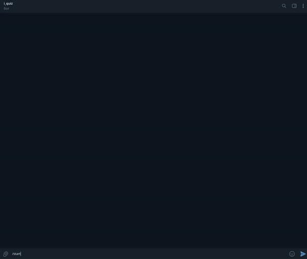
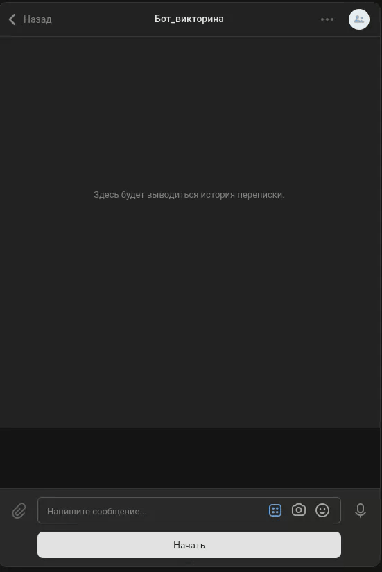

# Бот Виктарина 
Игра викторина в месенджере Telegram и социальной сети VK.


## Требования 
* рекомендуется Python 3.9(можно З.7, 3.8, 3.10)
* Базы данных Redis 
## Запуск проекта
### 1. Загрузка на локальное устройство 
```shell
git clon https://github.com/ZiganshinIB/quiz_bot.git
cd quiz_bot
```
### 2. Создание витруального окружение
```shell
python -m venv .venv
```
#### 2.1 Активация витруального окружение
```shell
source .venv/bin/activate
```
### 3. Установка зависимостей
```shell
pip install -r requirements.txt
```
### 4. Создание переменых сред
В проекте используются токены (ключи и пароли), которые не должны хранится в открытом доступе. По этому такие данные храним в системной переменных среде, следующим образом:
В директории с проектом создается файл `.env`
```shell
nano .env
```
Заполняется следующим способом
```text
TELEGRAM_BOT_TOKEN='Токен_для_телеграм_бота'
TELEGRAM_BOT_LOGS_CHAT_ID=1
VK_BOT_TOKEN='Токен_для_vk_бота'
REDIS_URL_DB_TG_USER="redis://<hostname>:<port>/<index_db(опцианально)>"
REDIS_URL_DB_VK_USER="redis://<hostname>:<port>/<index_db(опцианально)>"
REDIS_URL_DB_TG_COUNTER="redis://<hostname>:<port>/<index_db(опцианально)>"
REDIS_URL_DB_VK_COUNTER="redis://<hostname>:<port>/<index_db(опцианально)>"
REDIS_URL_DB_QUESTIONS="redis://<hostname>:<port>/<index_db(опцианально)>"
```
* TELEGRAM_BOT_TOKEN - Как получить токен для телеграм бота описана [тут](https://core.telegram.org/bots#how-do-i-create-a-bot)
* TELEGRAM_BOT_LOGS_CHAT_ID - идентификатор чата куда будуть логи работы программы. [Узнать чат id](https://docs.leadconverter.su/faq/populyarnye-voprosy/telegram/kak-uznat-id-telegram-gruppy-chata))
* VK_API_TOKEN инструкция по получению токена [тут](https://vk.com/@vksoftred-kak-poluchit-token-soobschestva-vkontakte)
* REDIS_URL_DB_TG_USER - url адрес базы данных для хранения пары (id в телеграмме, последний вопрос)
* REDIS_URL_DB_VK_USER - url адрес базы данных для хранения пары (id в vk, последний вопрос)
* REDIS_URL_DB_TG_COUNTER - url адрес базы данных для хранения пары (id в телеграмме, количество очков)
* REDIS_URL_DB_VK_COUNTER - url адрес базы данных для хранения пары (id в vk, количество очков)
* REDIS_URL_DB_QUESTIONS - url адрес базы данных для хранения пары (вопрос, ответ)

### 5. Перед запуском необходимо запольнит базу данных REDIS_URL_DB_QUESTIONS
Воспользутесь `qustions.py`
Требуется указать имя файла квиза или директории с файлами квиза
```shell
python3 qustions.py -f <имя файла>
```
или 
```shell
python3 qustions.py -f <название директории>
```
* Файл или Директории должны лежать в одной директории с проектом

### 6. Запуск проектов
```shell
python tg_bot.py
python vk_bot.py
```


